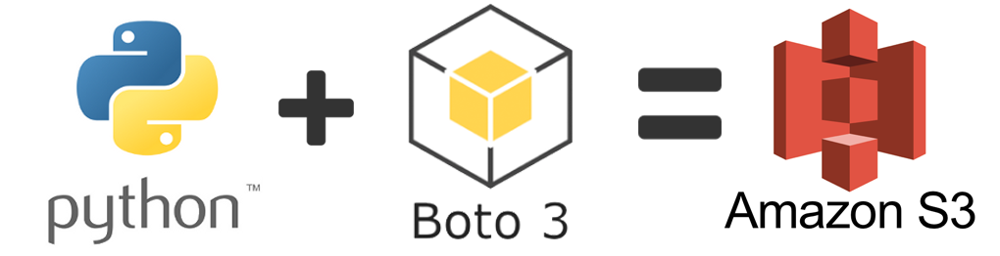


)

# "app-python-aws-s3" 

Leitura de extratos bancários no S3: Apartir dessa análise dos extratos foram determinados os scores dos clientes no banco

## requerimentos:

    boto==2.49.0

    boto3==1.26.72

    botocore==1.29.72

    jmespath==1.0.1

    python-dateutil==2.8.2

    s3transfer==0.6.0

    six==1.16.0

    urllib3==1.26.14
   
    
